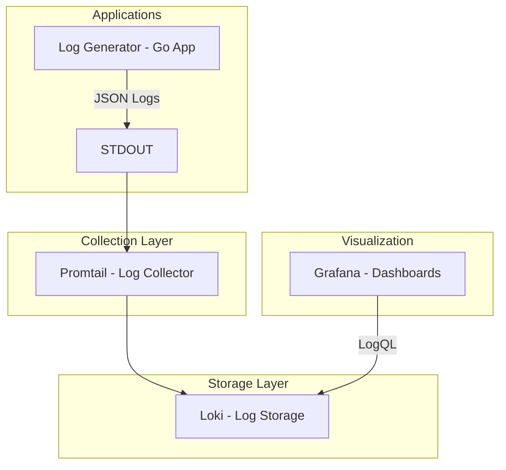

# Log Aggregator - Centralized Logging Platform

A centralized cloud observability platform for monitoring cloud-native infrastructure and applications in real-time. This project provides log aggregation using the Grafana Loki stack.

## Architecture



## Components

| Component | Purpose | Port |
|-----------|---------|------|
| **Log Generator** | Go application generating structured JSON logs | 8080 |
| **Promtail** | Log collection and shipping to Loki | 9080 |
| **Loki** | Log aggregation and storage | 3100 |
| **Grafana** | Visualization and dashboards | 3000 |

## Prerequisites

- Docker (version 20.10+)
- Docker Compose (version 2.0+)
- Kubernetes cluster (k3s, Minikube, or cloud provider)
- kubectl (for Kubernetes deployment)

## Quick Start

### Option 1: Docker Compose (Local Development)

```bash
# Start all services
docker compose up -d --build

# Access Grafana
open http://localhost:3000
```

### Option 2: Kubernetes Deployment

> **Note:** Container images are automatically built and pushed to the GitHub Container Registry (GHCR) by the CI/CD pipeline. No manual Docker builds are required.

```bash
# Deploy using the provided script (pulls images from GHCR)
chmod +x deploy-logs-only.sh
./deploy-logs-only.sh

# Or deploy manually
kubectl apply -f k8s/00-namespace.yaml
kubectl apply -f k8s/01-loki.yaml
kubectl apply -f k8s/02-promtail.yaml
kubectl apply -f k8s/03-grafana.yaml
kubectl apply -f k8s/04-log-generator.yaml
```

## External Access

### Using LoadBalancer (if supported)

```bash
# Get external IPs
kubectl get services -n logging

# Access Grafana at http://<EXTERNAL-IP>:3000
# Access Loki at http://<EXTERNAL-IP>:3100
```

### Using Port Forward (for k3s without LoadBalancer)

```bash
# Port forward Grafana
kubectl port-forward -n logging svc/grafana 3000:3000

# Port forward Loki (if needed)
kubectl port-forward -n logging svc/loki 3100:3100

# Access at http://localhost:3000
```

## Project Structure

```
log-aggregator/
├── app/
│   ├── Dockerfile              # Multi-stage Docker build
│   ├── go.mod                  # Go dependencies
│   ├── go.sum                  # Dependency lock file
│   └── main.go                 # Go application
├── config/
│   ├── dashboards/
│   │   ├── dashboards.yaml     # Dashboard provider config
│   │   └── logs-overview.json  # Logs dashboard
│   ├── grafana-datasources.yaml
│   ├── loki.yaml               # Loki configuration
│   └── promtail.yaml           # Promtail configuration
├── k8s/
│   ├── 00-namespace.yaml       # Kubernetes namespace
│   ├── 01-loki.yaml            # Loki StatefulSet (LoadBalancer)
│   ├── 02-promtail.yaml        # Promtail DaemonSet
│   ├── 03-grafana.yaml         # Grafana Deployment (LoadBalancer)
│   ├── 04-log-generator.yaml   # Log Generator Deployment
│   ├── 05-prometheus.yaml      # Prometheus (optional)
│   ├── 06-node-exporter.yaml   # Node Exporter (optional)
│   └── 07-kube-state-metrics.yaml # Kube State Metrics (optional)
├── docker-compose.yml          # Docker Compose stack
├── deploy-logs-only.sh         # Simplified deployment script
└── README.md
```

## Viewing Logs in Grafana

1. Open Grafana at `http://<IP>:3000` (auto-login as Admin)
2. Navigate to **Explore** (compass icon)
3. Select **Loki** as the data source
4. Use LogQL queries:

### Example LogQL Queries

```logql
# View all logs from log-generator
{app="log-generator"}

# Filter by ERROR level
{app="log-generator"} | json | level="ERROR"

# Filter by INFO level
{app="log-generator"} | json | level="INFO"

# Search for specific keyword
{app="log-generator"} |= "timeout"

# Count logs by level over time
sum by (level) (count_over_time({app="log-generator"} | json [$__interval]))
```

## Log Generator Application

The Go application generates structured JSON logs with different severity levels:

```json
{
  "time": "2024-01-15T10:30:00.000Z",
  "level": "INFO",
  "msg": "User logged in",
  "user_id": 123,
  "latency": "150ms"
}
```

### Log Levels
- **INFO**: Normal operations
- **ERROR**: Error conditions
- **DEBUG**: Debug information

## Persistence

| Service | Volume | Purpose |
|---------|--------|---------|
| Loki | `loki-data` | Log storage |
| Grafana | `grafana-data` | Dashboard and settings |

To reset all data:
```bash
# Docker Compose
docker compose down -v

# Kubernetes
kubectl delete -f k8s/
```

## Optional: Full Observability with Prometheus

For complete observability with infrastructure metrics, you can deploy Prometheus:

```bash
# Deploy Prometheus stack (optional)
kubectl apply -f k8s/05-prometheus.yaml
kubectl apply -f k8s/06-node-exporter.yaml
kubectl apply -f k8s/07-kube-state-metrics.yaml
```

This adds:
- **Prometheus**: Metrics collection and storage
- **Node Exporter**: Host-level metrics (CPU, memory, disk)
- **kube-state-metrics**: Kubernetes object metrics

## Troubleshooting

### Common Issues

1. **Pods not starting**
   ```bash
   # Check pod status
   kubectl get pods -n logging
   
   # Check pod logs
   kubectl logs -n logging <pod-name>
   
   # Describe pod for events
   kubectl describe pod -n logging <pod-name>
   ```

2. **Image pull errors from GHCR**
   - Ensure your Kubernetes cluster has the necessary permissions to pull images from `ghcr.io`
   - For private repositories, configure an ImagePullSecret:
     ```bash
     kubectl create secret docker-registry ghcr-secret \
       --docker-server=ghcr.io \
       --docker-username=<github-username> \
       --docker-password=<github-token> \
       -n logging
     ```
   - Reference the secret in your deployment or service account

3. **Grafana not accessible**
   ```bash
   # Use port-forward if LoadBalancer is not available
   kubectl port-forward -n logging svc/grafana 3000:3000
   ```

4. **Loki not receiving logs**
   - Check Promtail is running: `kubectl get pods -n logging -l app=promtail`
   - Check Promtail logs: `kubectl logs -n logging -l app=promtail`

## CI/CD Pipeline

The project includes a GitHub Actions workflow (`.github/workflows/ci-cd.yaml`) that automates the entire delivery process:

- **Linting and formatting checks** - Code quality validation
- **Unit tests with coverage** - Automated testing
- **Security scanning (Trivy)** - Vulnerability assessment
- **Image building and pushing to GHCR** - Container images are published to GitHub Container Registry
- **Automated Kubernetes deployment** - Continuous deployment to the target cluster

Images are tagged with both the commit SHA and `latest`, enabling rollback capabilities and consistent deployments.

## License

MIT License - See LICENSE file for details.

## Contributing

1. Fork the repository
2. Create a feature branch
3. Make your changes
4. Run tests and linting
5. Submit a pull request

## Acknowledgments

- [Grafana Loki](https://grafana.com/oss/loki/) for log aggregation
- [Grafana](https://grafana.com/) for visualization
- [Promtail](https://grafana.com/docs/loki/latest/clients/promtail/) for log shipping
