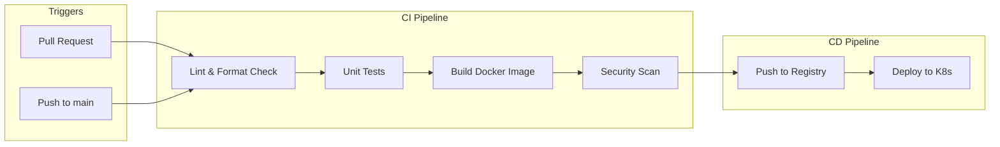

# Cloud Observability Platform - Architecture Plan

## Executive Summary

This plan extends the existing log aggregation system into a complete cloud observability platform with:
- **Prometheus** for infrastructure and application metrics
- **CI/CD Pipeline** using GitHub Actions for automated builds and deployments
- **Enhanced Go application** with metrics endpoint
- **Pre-built Grafana dashboards** for visualization

## Current State Analysis

### Existing Components
| Component | Status | File |
|-----------|--------|------|
| Go Log Generator | ✅ Working | `app/main.go` |
| Promtail | ✅ Working | `config/promtail.yaml`, `k8s/02-promtail.yaml` |
| Loki | ✅ Working | `config/loki.yaml`, `k8s/01-loki.yaml` |
| Grafana | ✅ Working | `k8s/03-grafana.yaml` |
| Docker Compose | ✅ Working | `docker-compose.yml` |
| Kubernetes Manifests | ✅ Working | `k8s/` directory |

### Missing Components
| Component | Purpose |
|-----------|---------|
| Prometheus | Infrastructure and application metrics |
| Node Exporter | Host-level metrics (CPU, memory, disk, network) |
| kube-state-metrics | Kubernetes object metrics |
| Go Metrics Endpoint | Application-level metrics |
| CI/CD Pipeline | Automated build, test, deploy |
| Grafana Dashboards | Pre-configured visualization |

## Target Architecture

```mermaid
flowchart TB
    subgraph Applications
        LG[Log Generator - Go App]
        LG -->|Logs| STDOUT
        LG -->|Metrics| PROM_ENDPOINT[/metrics endpoint]
    end

    subgraph Collection Layer
        PT[Promtail]
        PROM[Prometheus]
        NE[Node Exporter]
        KSM[kube-state-metrics]
    end

    subgraph Storage Layer
        LOKI[Loki - Log Storage]
        PROM_TSDB[Prometheus TSDB - Metrics Storage]
    end

    subgraph Visualization
        GF[Grafana]
    end

    subgraph CI/CD
        GH[GitHub Actions]
        GH -->|Build| IMG[Docker Image]
        GH -->|Push| REG[Container Registry]
        GH -->|Deploy| K8S[Kubernetes Cluster]
    end

    STDOUT --> PT
    PT --> LOKI
    PROM_ENDPOINT --> PROM
    NE --> PROM
    KSM --> PROM
    PROM --> PROM_TSDB
    
    GF -->|LogQL| LOKI
    GF -->|PromQL| PROM
```

## Detailed Implementation Plan

### Phase 1: Prometheus Integration

#### 1.1 Docker Compose Additions

Add the following services to `docker-compose.yml`:

```yaml
services:
  prometheus:
    image: prom/prometheus:latest
    container_name: prometheus
    ports:
      - "9090:9090"
    volumes:
      - ./config/prometheus.yaml:/etc/prometheus/prometheus.yml
      - prometheus-data:/prometheus
    command:
      - --config.file=/etc/prometheus/prometheus.yml
      - --storage.tsdb.path=/prometheus
    networks:
      - loki-stack
    restart: unless-stopped

  node-exporter:
    image: prom/node-exporter:latest
    container_name: node-exporter
    ports:
      - "9100:9100"
    networks:
      - loki-stack
    restart: unless-stopped

volumes:
  prometheus-data:
```

#### 1.2 Kubernetes Manifests

Create new files in `k8s/` directory:

| File | Purpose |
|------|---------|
| `05-prometheus.yaml` | Prometheus StatefulSet with RBAC |
| `06-node-exporter.yaml` | DaemonSet for node metrics |
| `07-kube-state-metrics.yaml` | Kubernetes object metrics |

#### 1.3 Prometheus Configuration

Create `config/prometheus.yaml` with scrape targets:

```yaml
global:
  scrape_interval: 15s
  evaluation_interval: 15s

scrape_configs:
  # Prometheus self-monitoring
  - job_name: 'prometheus'
    static_configs:
      - targets: ['localhost:9090']

  # Node Exporter - host metrics
  - job_name: 'node-exporter'
    static_configs:
      - targets: ['node-exporter:9100']

  # Go application metrics
  - job_name: 'log-generator'
    static_configs:
      - targets: ['log-generator:8080']
```

### Phase 2: Go Application Enhancement

#### 2.1 Add Prometheus Metrics to Go App

Modify `app/main.go` to include:

1. **HTTP server** with `/metrics` endpoint
2. **Custom metrics**:
   - `log_messages_total` (counter) - Total logs generated by level
   - `log_latency_seconds` (histogram) - Processing latency
   - `active_connections` (gauge) - Simulated connections
   - `request_duration_seconds` (histogram) - Request timing

3. **Dependencies** to add in `app/go.mod`:
   - `github.com/prometheus/client_golang`

#### 2.2 Updated Go Application Structure

```go
package main

import (
    "net/http"
    "github.com/prometheus/client_golang/prometheus"
    "github.com/prometheus/client_golang/prometheus/promhttp"
)

// Metrics declarations
var (
    logCounter = prometheus.NewCounterVec(
        prometheus.CounterOpts{
            Name: "log_messages_total",
            Help: "Total number of log messages generated",
        },
        []string{"level"},
    )
)

func init() {
    prometheus.MustRegister(logCounter)
}

func main() {
    // Start metrics server
    go func() {
        http.Handle("/metrics", promhttp.Handler())
        http.ListenAndServe(":8080", nil)
    }()
    
    // Existing log generation logic
    // ... with metrics instrumentation
}
```

### Phase 3: Grafana Enhancement

#### 3.1 Update Datasources

Modify `config/grafana-datasources.yaml`:

```yaml
apiVersion: 1

datasources:
  - name: Loki
    type: loki
    access: proxy
    url: http://loki:3100
    isDefault: true
    version: 1
    editable: false
    
  - name: Prometheus
    type: prometheus
    access: proxy
    url: http://prometheus:9090
    isDefault: false
    version: 1
    editable: false
```

#### 3.2 Pre-built Dashboards

Create `config/dashboards/` directory with:

| Dashboard | Purpose |
|-----------|---------|
| `logs-overview.json` | Log aggregation overview |
| `infrastructure-metrics.json` | CPU, memory, disk, network |
| `application-metrics.json` | Go app performance |
| `kubernetes-overview.json` | K8s cluster health |

### Phase 4: CI/CD Pipeline

#### 4.1 GitHub Actions Workflow

Create `.github/workflows/ci-cd.yaml`:



#### 4.2 Pipeline Stages

| Stage | Actions | Tools |
|-------|---------|-------|
| **Lint** | Code formatting, static analysis | `gofmt`, `golangci-lint` |
| **Test** | Unit tests, integration tests | `go test` |
| **Build** | Multi-arch Docker image | Docker Buildx |
| **Security** | Image vulnerability scan | Trivy |
| **Deploy** | Update K8s manifests | kubectl |

#### 4.3 Required Secrets

Configure in GitHub repository settings:
- `DOCKER_USERNAME` - Docker Hub username
- `DOCKER_PASSWORD` - Docker Hub password/token
- `KUBE_CONFIG` - Base64-encoded kubeconfig (for deployment)

### Phase 5: Kubernetes RBAC for Prometheus

Prometheus needs proper RBAC permissions to discover and scrape targets:

```yaml
apiVersion: rbac.authorization.k8s.io/v1
kind: ClusterRole
metadata:
  name: prometheus
rules:
- apiGroups: [""]
  resources:
  - nodes
  - nodes/metrics
  - services
  - endpoints
  - pods
  verbs: ["get", "list", "watch"]
- apiGroups: ["extensions", "networking.k8s.io"]
  resources: ["ingresses"]
  verbs: ["get", "list", "watch"]
- nonResourceURLs: ["/metrics", "/metrics/cadvisor"]
  verbs: ["get"]
```

## File Structure After Implementation

```
log-aggregator/
├── .github/
│   └── workflows/
│       └── ci-cd.yaml              # NEW: CI/CD pipeline
├── app/
│   ├── Dockerfile                  # Updated: metrics port
│   ├── go.mod                       # Updated: prometheus dependency
│   ├── go.sum                       # NEW: dependency lock
│   └── main.go                      # Updated: metrics endpoint
├── config/
│   ├── dashboards/                  # NEW: Grafana dashboards
│   │   ├── logs-overview.json
│   │   ├── infrastructure-metrics.json
│   │   ├── application-metrics.json
│   │   └── kubernetes-overview.json
│   ├── grafana-datasources.yaml     # Updated: add Prometheus
│   ├── loki.yaml                    # Unchanged
│   ├── prometheus.yaml              # NEW: Prometheus config
│   └── promtail.yaml                # Unchanged
├── k8s/
│   ├── 00-namespace.yaml             # Unchanged
│   ├── 01-loki.yaml                 # Unchanged
│   ├── 02-promtail.yaml             # Unchanged
│   ├── 03-grafana.yaml              # Updated: add Prometheus datasource
│   ├── 04-log-generator.yaml        # Updated: metrics port
│   ├── 05-prometheus.yaml           # NEW: Prometheus StatefulSet
│   ├── 06-node-exporter.yaml        # NEW: Node Exporter DaemonSet
│   └── 07-kube-state-metrics.yaml   # NEW: Kube State Metrics
├── docker-compose.yml               # Updated: add Prometheus services
└── README.md                        # Updated: new architecture docs
```

## Metrics to Collect

### Infrastructure Metrics (Node Exporter)
| Metric | Description |
|--------|-------------|
| `node_cpu_seconds_total` | CPU time by mode |
| `node_memory_MemAvailable_bytes` | Available memory |
| `node_filesystem_avail_bytes` | Disk space available |
| `node_network_receive_bytes_total` | Network bytes received |
| `node_network_transmit_bytes_total` | Network bytes transmitted |

### Application Metrics (Go App)
| Metric | Type | Description |
|--------|------|-------------|
| `log_messages_total` | Counter | Total logs by level |
| `log_latency_seconds` | Histogram | Log processing latency |
| `http_requests_total` | Counter | HTTP requests to /metrics |
| `go_goroutines` | Gauge | Number of goroutines |
| `go_memstats_alloc_bytes` | Gauge | Memory allocation |

### Kubernetes Metrics (kube-state-metrics)
| Metric | Description |
|--------|-------------|
| `kube_pod_status_phase` | Pod status by phase |
| `kube_deployment_status_replicas` | Deployment replicas |
| `kube_node_status_condition` | Node conditions |
| `kube_persistentvolumeclaim_status` | PVC status |

## Dashboard Panels

### Logs Overview Dashboard
- Log volume over time (by level)
- Error rate percentage
- Top log sources
- Log latency distribution

### Infrastructure Dashboard
- CPU utilization per node
- Memory usage percentage
- Disk I/O throughput
- Network traffic (in/out)
- Load average

### Application Dashboard
- Request rate
- Error rate
- Response time (p50, p95, p99)
- Active connections
- Goroutine count

## Implementation Order

1. **Phase 1**: Add Prometheus to Docker Compose (local testing)
2. **Phase 2**: Extend Go application with metrics
3. **Phase 3**: Create Kubernetes manifests for Prometheus stack
4. **Phase 4**: Update Grafana datasources and dashboards
5. **Phase 5**: Implement CI/CD pipeline
6. **Phase 6**: Documentation and testing

## Success Criteria

- [ ] Prometheus successfully scrapes metrics from all targets
- [ ] Go application exposes `/metrics` endpoint
- [ ] Grafana displays both logs and metrics
- [ ] CI/CD pipeline builds and deploys automatically
- [ ] Dashboards show real-time infrastructure and application data
- [ ] All services run in both Docker Compose and Kubernetes

## Next Steps

After approval, switch to **Code mode** to implement:
1. Create Prometheus configuration files
2. Modify Go application for metrics
3. Create Kubernetes manifests
4. Set up GitHub Actions workflow
5. Create Grafana dashboards